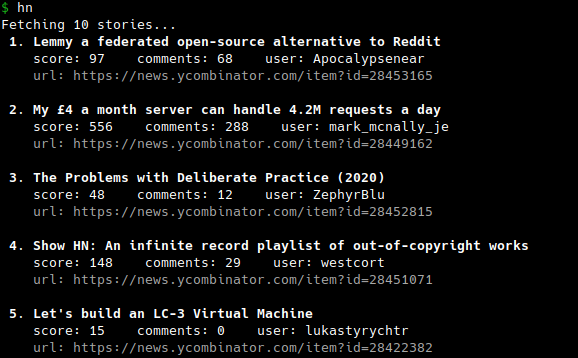

# Hacker News Title Downloader for the terminal

Download and show the top N article titles from the Hacker News homepage.
Written in [Rust](https://www.rust-lang.org/), inspired by the [V version](https://github.com/BafS/hn-top).

Using [getopts](https://docs.rs/getopts/0.2.21/getopts/) for parsing commandline arguments, [reqwest](https://docs.rs/reqwest/0.11.4/reqwest/) for retrieving the data and [colored](https://docs.rs/colored/2.0.0/colored/) terminal output.

## Usage

```
$ hn -h
Hacker news downloader.
Usage: hn [-n <number>]

Options:
    -n NUMBER           the number of entries to download (1-99, default: 10)
    -h, --help          print this help menu
```

## Example



## Installation

Clone repo and change into the directory.
Then either run `./build.sh` (executable will be in `./bin/hn`) or execute `cargo build --release` (executable will be in `./target/release/hn`)